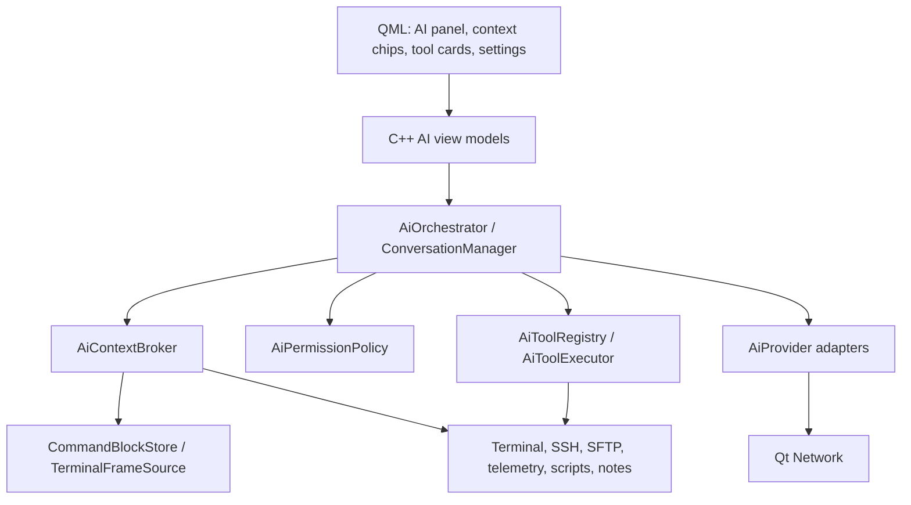

# V3 AI architecture

Status: accepted architecture baseline for `0.3.x`

## Current reusable seams

V2 already provides most of the native execution substrate:

- `TerminalOutputSink` and `TerminalOutputFanout` deliver raw local/SSH output
  without coupling consumers to the renderer;
- `AppController::queueInput` and `queuePaste` route interactive input, while
  `observeTerminalInput` currently captures only heuristic command history;
- `TerminalEngine` owns VT state and immutable snapshots, including cell data,
  cursor, scroll position, and shell-reported working directory;
- local ConPTY and SSH sessions already have bounded input queues, cancellation,
  latency metrics, and orderly worker ownership;
- shell history, scripts, notes, telemetry, SFTP, transfers, forwarding, and
  credentials already live behind C++ application/domain/infrastructure APIs.

The AI layer extends these seams. It does not replace the terminal engine, route
raw input through a model, or make `AppController` a provider implementation.

## Target layers



### Domain

Plain C++ types, independent from QML and provider JSON:

- `AiConversation`, `AiTurn`, `AiMessage`, `AiContentPart`;
- `AiContextItem` with kind, source, session ID, generation, sensitivity,
  timestamp, size, and truncation metadata;
- `CommandBlock` with exact/fallback command, output segments, exit status, CWD,
  shell, host, lifecycle, and attribution quality;
- `TerminalFrame` with bounded grid text, cursor, dimensions, alternate-screen,
  generation, and changed-region metadata;
- `AiToolDefinition`, `AiToolCall`, `AiToolResult`, `AiToolState`;
- `AiToolDispatchRecord` keyed by conversation, turn, provider tool-call ID,
  tool name, and normalized-argument hash;
- `AiPermissionDecision` and `AiAuditEvent`;
- `AiStreamEvent` as a closed variant: response start, text/reasoning delta,
  tool-call start/argument delta/end, usage, completion, cancellation, error.

### Application

- `AiOrchestrator` owns one turn's state machine and cancellation.
- `AiConversationManager` owns scoped conversations and optional persistence.
- `AiContextBroker` resolves, redacts, deduplicates, bounds, and serializes
  context for the selected provider.
- `AiToolRegistry` advertises only tools available for the active scope and
  capability level.
- `AiToolExecutionBroker` validates schema and scope, asks policy, dispatches to
  existing services, and returns bounded typed results.
- `ShellIntegrationCoordinator` manages capability discovery and command-block
  lifecycle without placing shell-specific parsing in QML.

### Infrastructure

- `OpenAiResponsesProvider` consumes SSE and maps events to `AiStreamEvent`;
- `OpenAiCompatibleProvider` supports explicitly tested compatible endpoints
  and does not claim universal Responses compatibility;
- `OllamaProvider` consumes native NDJSON streaming;
- `AiSecretStore` stores API keys through the existing installed/portable vault
  coordinator;
- `AiConversationStore` uses bounded authenticated encryption for optional
  transcript persistence; Windows Credential Manager stores only its small data
  key, not transcript payloads;
- `AiAuditStore` stores metadata and redacted summaries, never raw terminal input
  or provider credentials.

## Terminal semantic data flow

```text
raw PTY/SSH output
  -> TerminalOutputFanout
  -> TerminalEngine (unchanged render path)
  -> ShellIntegrationDecoder (OSC lifecycle/CWD/command)
  -> CommandBlockAssembler
  -> bounded CommandBlockStore

explicit AI context request
  -> AiContextBroker
  -> command block, selection, range, or TerminalFrame
  -> normalize control sequences and provenance
  -> local secret redaction
  -> size/token budget and deduplication
  -> user-visible context preview
  -> provider adapter
```

There are two different consumers and they must not be conflated:

- **semantic capture** receives ordered lifecycle and output records from a
  bounded terminal journal. It does not silently coalesce bytes. If its bounded
  journal overruns, the affected block records an exact coverage gap and dropped
  byte count;
- **derived observation** feeds previews, provider context, frame refresh, and
  UI. It may coalesce frame generations or discard stale updates because it can
  always rebuild from retained semantic state.

Neither path may backpressure terminal parsing or input. A finished lifecycle
means the command ended; it never implies that captured output is complete.

## Shell integration

### Capability levels

| Level | Evidence | Allowed claims and UI |
| --- | --- | --- |
| None | Raw output only | Raw/approximate badge; bounded range/frame; Explain last failure disabled |
| Basic | OSC 133 lifecycle and/or reliable CWD | Approximate badge; only fields actually observed may be claimed; Explain last failure requires an observed non-zero exit status |
| Rich | Ordered lifecycle, exact command event, verified nonce | Verified badge; exact command, boundary, exit status, CWD, and integration source |

Support interoperable OSC 133 markers and compatible OSC 633 semantics. A
ztermy-owned integration injects a per-session nonce into the exact-command
event. Unverified OSC text can improve navigation but cannot waive permission or
be treated as trusted command identity.

No shell startup file is modified silently. This is a dedicated shell-
integration installer rule, not a blanket prohibition on Unix dotfiles or
hidden files. The default path is ephemeral activation
for a ztermy-owned shell using a generated, versioned session wrapper where the
shell supports it. A separate persistent installer may be offered only through
an explicit user action that previews the exact path/diff, creates a backup,
uses a guarded version marker and atomic replacement, verifies the result, and
provides uninstall/restore. Remote installation is separately authorized per
saved host; quick connections never persist integration. Failure or refusal
degrades capability instead of weakening execution policy or rewriting startup
files behind the user. `tmux` passthrough configuration is never changed
automatically. ADR 0055 owns the detailed contract.

The existing raw-input command reconstruction remains history convenience only.
It is not used as authoritative AI command context after rich integration ships.

## Command blocks and output attribution

`CommandBlockStore` is a bounded per-session ring. Each block has:

- stable block ID plus session generation;
- command text and confidence/provenance;
- start/finish timestamps and optional exit status;
- CWD before/after, shell kind, profile ID, and display target;
- bounded plain output plus truncation and has-more metadata;
- retained sequence range plus coverage (`complete`, `bounded-head-tail`,
  `gapped`, `interleaved`, `unknown`), lost-byte count, and earliest/latest
  readable cursors;
- optional style-preserving fragments only when a feature needs them;
- background/interleaved-output flags;
- lifecycle: pending, running, waiting, finished, interrupted, disconnected,
  unknown.

Output arriving between verified pre-execution and completion is attributed to
the active foreground block, but background writes can still interleave. The
store must expose that uncertainty instead of inventing per-process attribution.

Alternate-screen programs additionally expose a `TerminalFrame`; their current
grid is not appended repeatedly as ordinary scrollback. Frame deltas supersede
older frames during context compaction.

## Context broker

Context selection order:

1. explicit user attachments and selected text;
2. requested command block or last failed command;
3. active running frame when relevant;
4. scoped session identity, CWD, shell, and connection state;
5. optional telemetry/SFTP/script/note items requested by a tool;
6. bounded recent context only when the user enables automatic context.

Every item includes provenance, evidence quality, coverage, and truncation. The
preview allows removal and pinning; a pin affects selection priority but cannot
bypass local redaction, provider limits, or the hard aggregate bound. The broker
strips escape sequences not required by the task, normalizes line endings,
removes duplicate latest reads, retains recent tool results, and preserves
stable state across compaction: user goal, permission mode, target scope, active
command IDs, unresolved errors, and pending tool calls. Historical user/model
messages and tool results are untrusted evidence after replay; they cannot carry
forward an old authorization.

The `0.3.0` automatic-context baseline is the requested/failed block plus at
most five preceding completed blocks and one current terminal frame, bounded to
64 KiB, 1,000 normalized lines, and an estimated 16,000 input tokens in total.
One item is capped at 16 KiB and 300 lines. Explicit attachments use the same
aggregate hard bounds and displace lower-priority automatic items. These are
versioned configuration defaults covered by tests, not QML magic numbers.
Providers may report exact token usage, but the broker keeps a provider-neutral
byte/line estimate so a provider switch cannot disable bounds.

## Provider contract

Conceptual C++ boundary:

```cpp
class AiProvider {
public:
    virtual ~AiProvider() = default;
    virtual ProviderCapabilities capabilities() const = 0;
    virtual std::unique_ptr<AiRequestHandle> start(
        const AiRequest& request,
        AiStreamObserver& observer) = 0;
};
```

`AiRequestHandle` owns cancellation and outlives the network reply until a final
event. Provider adapters validate event order, accumulate fragmented tool
arguments with an explicit size limit, and emit one terminal state. Late events
after cancellation or scope-generation changes are discarded.

Provider errors are classified. Authentication/configuration failures are not
retried. `Retry-After` is honored for 429 when present; otherwise transient 408,
429, selected 5xx, connection reset, and pre-response timeout use capped
exponential backoff with jitter. The default is two retries. A stream failure
after a side-effecting tool may have executed never replays that tool; it resumes
from the dispatch record or surfaces an explicit uncertain result.

Qt Network is sufficient: `QNetworkAccessManager` starts asynchronous requests,
and `QNetworkReply::readyRead` feeds an incremental SSE/NDJSON parser. Provider
code never blocks on a synchronous HTTP call and never exposes `QJsonObject` to
the domain or QML layers.

## Initial tool catalog

| Tool | Mode | Milestone | Backing service |
| --- | --- | --- | --- |
| `read_session_info` | Read | 0.3.0 | active tab/session state |
| `read_terminal` | Read | 0.3.0 | command store/frame source |
| `read_command_block` | Read | 0.3.0 | command store |
| `run_command` | Write | 0.3.1 | existing input queue + block lifecycle |
| `read_command_output` | Read | 0.3.1 | command store/frame source |
| `wait_command` | Read/wait | 0.3.1 | lifecycle subscription |
| `write_to_pty` | Write | 0.3.1 | session input queue |
| `interrupt_command` | Write | 0.3.1 | session interrupt path |
| `list_sftp` / `read_sftp_file` | Read | 0.3.2 | SFTP session service |
| SFTP mutations | Write | 0.3.2 | transfer/batch job graph |
| telemetry/forwarding/scripts/notes | Mixed | 0.3.2 | existing bounded services |

Tool results use domain error codes (`not_connected`, `scope_changed`,
`permission_denied`, `timeout`, `cancelled`, `truncated`, `cursor_expired`,
`outcome_unknown`, `duplicate_mismatch`, `unsupported`) plus a localized UI
message. The model receives stable machine-readable codes and a short provider-
language description.

All ztermy-native tools above are implicitly bound to the sidebar's owning
terminal. Provider-visible schemas, results, context, and prompts contain no
tab ID or reconnect generation, and no session-discovery tool is advertised.
The application captures the owning tab ID and generation at turn start and
uses them only as an internal lifetime guard. A focus change cannot redirect a
turn; tab closure or reconnect invalidates outstanding live work with
`scope_changed`. ADR 0086 owns this contract.

### Tool execution contract

- The dispatch key is `(conversation, turn, tool-call id)`. Tool name and a
  canonical argument hash are stored with it. An identical replay joins the
  active operation or receives the cached result; the same ID with different
  arguments fails closed. Provider retries cannot create a new write dispatch.
- `run_command` returns a stable command/block ID after the input queue accepts
  the command. It does not claim process completion.
- `read_command_output` is cursor-based: `after_cursor` plus `max_bytes` returns
  retained segments, `next_cursor`, lifecycle, coverage, and whether additional
  retained bytes exist. Evicted bytes return `cursor_expired`; ztermy never
  silently re-runs a command to recreate output.
- `wait_command` subscribes to lifecycle changes with a deadline. Cancelling one
  waiter removes only that subscription, not the command or other waiters.
- `interrupt_command(soft)` sends the session's user-equivalent interrupt
  through the owned ConPTY/SSH PTY input path. It is not a kill guarantee.
  Closing a session is a separate destructive capability. SSH disconnect or an
  untracked remote process may produce `outcome_unknown`.
- At most one Agent conversation owns the internal write lease for a terminal
  session. Other Agent conversations may observe and wait. Cancelling an
  observer never interrupts another Agent's command.
- Direct user input is always accepted through the same ordered PTY input queue.
  It neither requires a Take control action nor creates a sticky user-owned
  state. Agent-to-Agent serialization remains internal and is surfaced only as
  a concrete busy/conflict result when two autonomous writers contend.

ADR 0056 owns dispatch idempotency, risk overlay, ownership, budgets, and these
tool lifecycle semantics.

## Conversation persistence

`0.3.0` defaults to session-only conversations. Encrypted history is opt-in when
it arrives in `0.3.1`. Provider IDs, model IDs, API keys, and non-secret UI
preferences persist separately. The initial provider order is OpenAI Responses,
Ollama, then generic OpenAI-compatible; the last successful model is remembered.

Optional history in `0.3.1` uses:

- one random data-encryption key per store;
- AES-256-GCM authenticated records with schema and monotonically increasing
  generation;
- installed mode: data key protected by the existing Windows credential
  boundary;
- portable mode: data key wrapped by the portable vault;
- bounded total bytes, conversation count, and retention age;
- explicit export/delete and fail-closed schema handling.

ADR 0061 fixes the concrete first-store contract at AES-256-GCM, a dedicated
vault-managed data key, schema/generation AAD, fresh nonce per rewrite, and
bounded 50-conversation/90-day retention. A serialized application worker now
owns every store operation; the opt-in settings surface supports browsing,
restore, explicit decrypted export, and deletion without blocking the GUI.
Restore accepts user/assistant text only and cannot revive tools or grants.

No transcript is written to diagnostic logs, generic workspace JSON, or Windows
Credential Manager.

## QML/UI boundary

QML owns presentation only:

- AI side-panel layout, input, context chips, tool cards, progress, animations,
  menus, and keyboard focus;
- no provider HTTP, stream parser, prompt construction, permission decision,
  secret access, terminal scrape, or tool execution;
- all list models are immutable or generation-checked C++ projections;
- evidence badges (`Verified`, `Approximate`, `Raw`, `Partial`) describe source
  quality rather than truth, and every generated explanation preserves source
  attribution;
- the provider/model picker remembers the last successful selection in `0.3.0`
  while each conversation may override it;
- token usage and provider-reported usage are exact when available; monetary cost
  is explicitly labeled as an estimate with pricing-table date, and local or
  unknown-cost providers show tokens only;
- an AI activity view exposes redacted audit metadata, permission decisions,
  target identity, tool lifecycle, and result codes without raw secrets;
- the first activity implementation stores one bounded card per tool call,
  hashes conversation/call identity, validates every persisted token, caps the
  trail at 500 records, and performs atomic last-known-good rewrites on a
  single worker queue; arguments and terminal/provider text never enter the
  activity model or export (ADR 0060);
- UI cancellation calls an owned C++ handle and immediately reflects cancelling
  state while teardown completes asynchronously.

## Threading, backpressure, and shutdown

- Terminal input/output retains priority over all AI work.
- Provider streams have bounded event and partial-JSON buffers.
- At most one active model turn per conversation in `0.3.0`; different terminal
  conversations may run concurrently under a global configured limit.
- Tool calls targeting one session serialize through that session's existing
  command gate and one-writer lease unless the backing service already owns safe
  read concurrency.
- Default per-turn watchdogs are 24 total tool calls, 8 side-effecting actions,
  15 minutes, two transient provider retries, and three identical reads without
  a state-generation change. Reaching a limit stops the turn with a visible
  reason; an explicit Continue starts a new budget rather than mutating history.
- Read-frame updates coalesce to the latest generation.
- Stop order: close AI command gates, cancel provider replies, cancel tool waits,
  detach output observers, flush/close encrypted stores, then join owned workers.
- No detached threads and no callback may retain a destroyed session, QML item,
  or `QNetworkReply`.

## Required follow-up ADRs

The top-level decision is ADR 0054. ADR 0055 defines shell-integration activation
and ADR 0056 defines agent dispatch and ownership. Later milestones must add
focused ADRs before committing to:

- encrypted conversation-store format and migration;
- saved-host automatic grant storage, precedence, expiry, and revocation;
- interactive-frame delta and Agent lease/contention protocol;
- MCP transport and tool-namespace policy.
